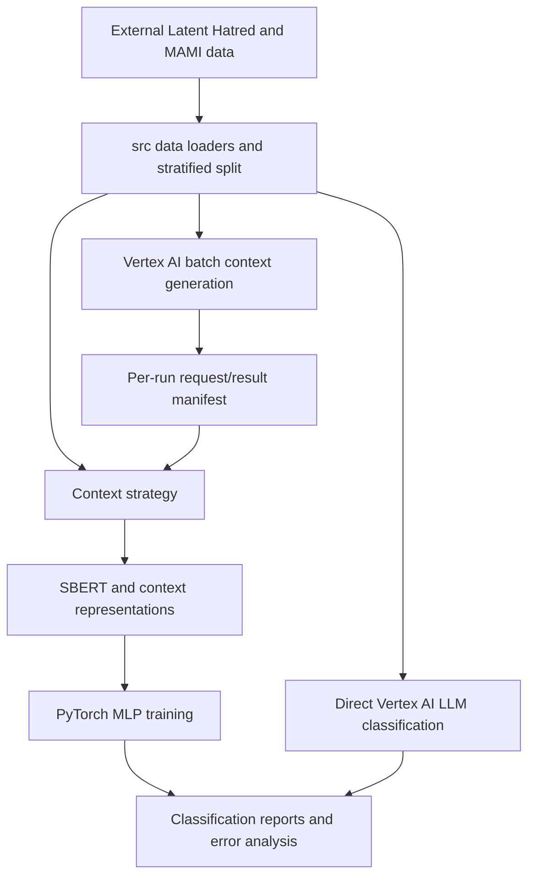

# Architecture

```yaml
document: "ARCHITECTURE"
owner: "Joshua Brook"
last_updated: "2026-09-09"
```

---

## 1. Executive Summary

The implemented system is a repository-root `src` Python module plus a guided Kaggle-oriented Jupyter notebook, `orchestrator.ipynb`. The module defaults to the checked-in Latent Hatred and MAMI Base/Context CSVs, while retaining an optional raw Latent Hatred-stage loader; it produces Sentence-BERT and supplementary context representations, trains a PyTorch MLP, and returns structured evaluation results. The notebook provides a single `RUN` configuration block, validates selected inputs before model loading, and invokes these public functions. Google Vertex AI batch jobs and Cloud Storage are optional; every cloud batch has an explicit local manifest and isolated result prefix.

## 2. Tech Stack

| Component | Technology | Purpose |
|-----------|------------|---------|
| Experiment runtime | Jupyter/Kaggle notebook with Python | Orchestrates preprocessing, training, reporting, and cloud batch calls. |
| Text representation | `sentence-transformers/all-mpnet-base-v2`, Hugging Face Transformers | Creates sentence embeddings and supports Context-Embed fusion. |
| Classifier | PyTorch MLP | Classifies embeddings for binary, multi-class, and multi-label tasks. |
| Data processing/evaluation | pandas, NumPy, scikit-learn, statsmodels | Splits data, transforms features, and reports metrics. |
| LLM and cloud batch processing | Google GenAI Vertex AI client, Google Cloud Storage | Generates context and runs direct LLM classification. |
| Entity/context baselines | REL API, Wikipedia API, ConceptNet Numberbatch | Provides comparison context derived from entities and knowledge embeddings. |
| Configuration | Dataclasses and environment variables | Holds paths, training defaults, model settings, and non-secret Vertex settings. |
| Tests | pytest | Verifies pure data, representation, strategy, manifest, and parser behavior without cloud or GPU access. |

## 3. High-Level Shape



## 4. Major Components

| Component | Responsibility | Notes |
|-----------|----------------|-------|
| `orchestrator.ipynb` | Guided Kaggle orchestration and reporting | Explains experiment choices, sets a single `RUN` block, validates paths, and initializes Vertex only when selected. |
| `src/` | Reusable experiment implementation | Contains typed config, preflight validation, data loading, representations, MLP evaluation, one named experiment dispatcher, and Vertex batch utilities. |
| `tests/` | Offline unit verification | Mocks model/cloud work and does not require source data, GPU, or credentials. |
| `paper.pdf` | Research specification and results record | Describes methodology, reported results, limitations, and ethical considerations. |
| `data/latent hatred/LH_Context.csv` | Textual generated-context output | Includes Latent Hatred IDs, posts, labels, and LLM responses. |
| `data/latent hatred/LH_NER.csv` | Textual annotation artefact | Includes Latent Hatred records and named-entity annotations. |
| `data/mami/MAMI_Context.csv` | Multimodal generated-context output | Includes meme text/image descriptions, labels, and LLM responses. |

## 5. Main Runtime Flows

### Primary flow: embedding classifier experiments

1. The notebook applies user-provided `RUN` paths and context-source choice, builds `ExperimentConfig`, and calls preflight validation for the selected dataset and experiment.
2. The loaders create stratified 80/20 train/test splits with seed 42; each repeated training run uses the configured deterministic seed sequence.
3. `run_experiment(name, ...)` creates zero-context, entity-derived, generated-context, or fused representations and calls the common MLP evaluator.
4. A four-layer PyTorch MLP (three 512-unit ReLU hidden layers plus output layer) trains for 500 epochs with Adam at learning rate 0.001; it returns per-run and averaged classification reports, macro precision/recall/F1, and best predictions.

### Secondary flow: LLM batch generation and prediction

1. When the user chooses `context_source='rerun'`, the notebook retrieves `GOOGLE_API_KEY` from Kaggle Secrets and initializes Google Cloud clients; the module receives those clients explicitly.
2. The module serializes prompts to a run-specific local JSONL file, writes a manifest, uploads to a unique Cloud Storage input URI, and creates a Vertex AI batch job using the configured model and location.
3. The manifest records the job name and result prefix. Result collection only accepts one JSONL file under that exact prefix, then persists the resolved URI to the same manifest.
4. The generated responses are parsed into dataframes for explicit downstream merging, context CSV creation, or prediction evaluation. No batch helper selects the latest object in a shared bucket.

## 6. Data Model or Storage Shape

- Latent Hatred records: ID, post, source class, implicit class, derived binary class, and optional generated context.
- MAMI records: meme ID, extracted text, image description, binary misogyny label, four subtype labels, derived post text, and optional generated context.
- Embeddings: in-memory numpy vectors stored in dataframe columns; they are not persisted as a model artefact.
- Run manifests: JSON documents under `artifacts/manifests/` recording a UUID, model, local request file, Cloud Storage request URI, output prefix, job name, and resolved result URI.
- Cloud files: JSONL requests and batch outputs in a unique configured Cloud Storage prefix for each manifest.

## 7. Important Paths or Modules

- `orchestrator.ipynb`: guided runnable experiment sequence.
- `src/config.py` and `src/onboarding.py`: typed settings and selected-run preflight validation.
- `src/data.py`, `embeddings.py`, `context.py`, `modeling.py`, `experiments.py`, `vertex.py`: reusable pipeline components; `experiments.py` exposes the single named experiment dispatcher.
- `tests/`: offline unit suite.
- `data/latent hatred/`: included Latent Hatred context and NER artefacts.
- `data/mami/`: included MAMI context artefact.
- `paper.pdf`: paper-level methodological and evaluation reference.
- `docs/`: project-management documentation; not part of the model runtime.

## 8. External Systems and Dependencies

- Kaggle: intended notebook runtime, GPU environment, and secret management.
- Google Vertex AI and Cloud Storage: batch LLM inference and request/output staging; access uses a Kaggle-held API key and configured project credentials.
- REL API and Wikipedia: named-entity-linked context baseline.
- ConceptNet Numberbatch: embedding baseline loaded from an external local file.
- MAMI images: required only for fresh image-context generation; the normal Base/Context CSV experiments use the checked-in data artefacts.

## 9. Operational Notes

- `requirements.txt` pins the Kaggle Python 3.10 runtime dependencies. The orchestrator rejects local Python 3.14+ before installation because the pinned NumPy/PyTorch wheels are not available for that interpreter.
- Hugging Face downloads use a project-local cache on local runs and `/kaggle/working/contextual-hsd-cache/` on Kaggle, because attached Kaggle datasets are read-only.
- The notebook's `device='auto'` setting selects CUDA only when available and otherwise uses CPU. GPU remains the practical runtime for timely full experiments.
- There is no CLI or package-install metadata; the Kaggle notebook imports `src` directly from the attached repository root.
- No CI pipeline or deployment target is present.
- The paper and notebook disagree on the Gemini model generation: the paper reports Gemini 2.0 Flash, while the current notebook configures `gemini-2.5-flash-lite`. Re-running the notebook is not a direct reproduction of the paper without resolving this difference.

## 10. Security and Permissions

- The current notebook gets `GOOGLE_API_KEY` through Kaggle Secrets rather than from a checked-in file.
- Cloud access depends on `USC().set_gcloud_credentials(project=PROJECT_ID)` and the caller's configured Kaggle/Google Cloud permissions.
- The non-secret project and bucket names are supplied through the notebook `RUN` block or environment-backed defaults; credentials are not embedded in the notebook.
- Research inputs and generated outputs may include hateful, racist, sexist, or other offensive material and should be handled with appropriate access and display controls.

## 11. Open Constraints

- A complete rerun requires external source data, MAMI images, ConceptNet vectors, GPU access, Kaggle secrets, and Google Cloud permissions that are not distributed here.
- The package validates an unambiguous JSONL result under the run-specific prefix, but Vertex result object naming remains controlled by the service.
- The repository has no data checksums or prompt-version ledger, limiting strict reproducibility despite deterministic local splits/training seeds and batch manifests.
